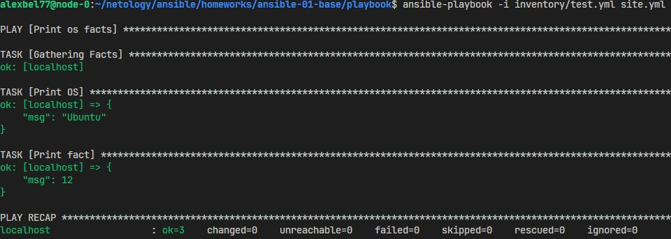
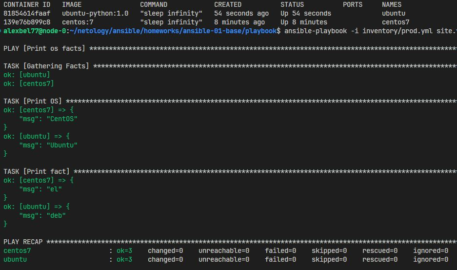
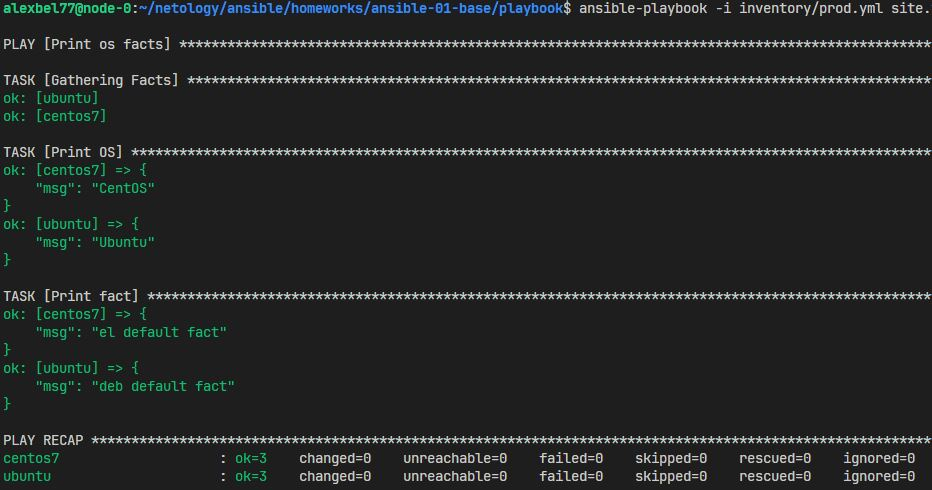
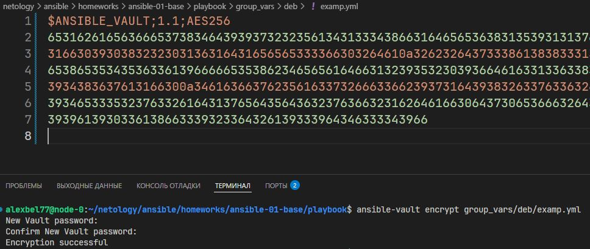
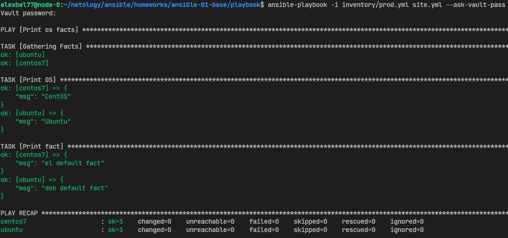
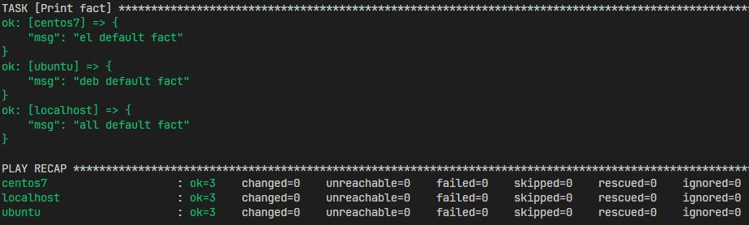

# Домашнее задание к занятию 1 «Введение в Ansible»

## Задание 1 

<center>
  
</center>

## Задание 3

При выполнении столкнулся с ошибкой `No python interpreters found for host ubuntu`. 
Поэтому был собран образ на базе ubuntu:22.04 с установкой **python**. [Dockerfile](https://github.com/alex-bel31/ansible/tree/main/ansible-01-base/Dockerfile)

## Задание 4

<center>
  
</center>

## Задание 6

<center>
  
</center>

## Задание 7

<center>
  
</center>

## Задание 8

<center>
  
</center>

## Задание 9

```bash
ansible-doc -t connection -l
```
`ansible.builtin.local` - подходящий плагин для работы на control node.

## Задание 11

В `prod.yml` добавлена новая группа хостов **local**. `some_fact` для каждого из хостов определены из верных **group_vars**.

<center>
  
</center>