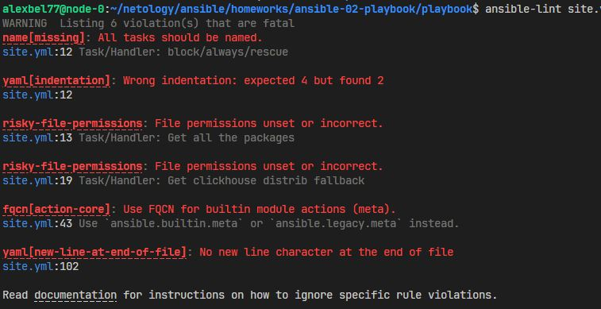
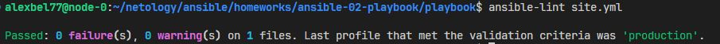
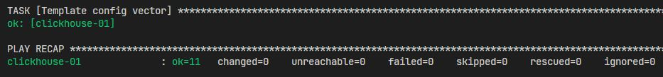

# Домашнее задание к занятию 2 «Работа с Playbook»

## Задание 5

  

  

## Задание 8

  

## Задание 9

Ссылка на документацию к **Ansible Playbook: ClickHouse и Vector**: [README.md](https://github.com/alex-bel31/ansible/blob/main/ansible-02-playbook/playbook/README.md)

## Задание 10

Ссылка на фиксирующий коммит **Ansible Playbook: ClickHouse и Vector**: [08-ansible-02-playbook](https://github.com/alex-bel31/ansible/releases/tag/08-ansible-02-playbook)