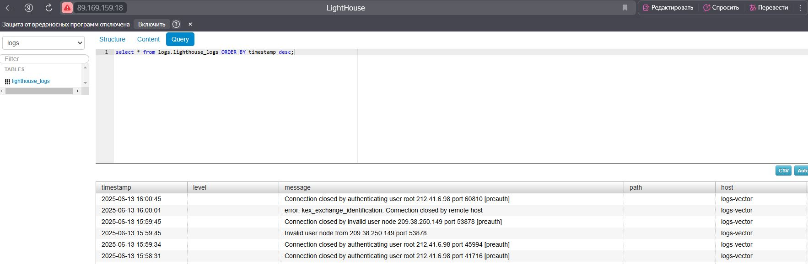

# Ansible-плейбук: Установка ClickHouse + Vector + Lighthouse

1. В файле `requirements.yml` используемые роли подключаются напрямую из git. 

2. Для установки зависимостей была использована команда:

    ```bash
    ansible-galaxy install -r requirements.yml -p roles
    ```
3. На основе tasks из старого playbook были собраны две роли:

    - [ansible-vector](https://github.com/alex-bel31/ansible-vector)
    - [ansible-lighthouse](https://github.com/alex-bel31/ansible-lighthouse)

    Роль `lighthouse` включает установку Nginx, так как он является частью инфраструктуры  Lighthouse, а также упрощает развёртывание и  повышает читаемость кода. 

9. После установки ClickHouse создаётся таблица lighthouse_logs, в которую Vector отправляет данные логов:

    ```sql
    CREATE TABLE IF NOT EXISTS {{clickhouse_database}}.{{clickhouse_table}} (
    timestamp DateTime,
    level String,
    message String,
    path String,
    host String
    ) ENGINE = MergeTree()
    ORDER BY timestamp;
    ```
5. Скриншот из Lighthouse c таблицей логов

    <center>
    
    </center>