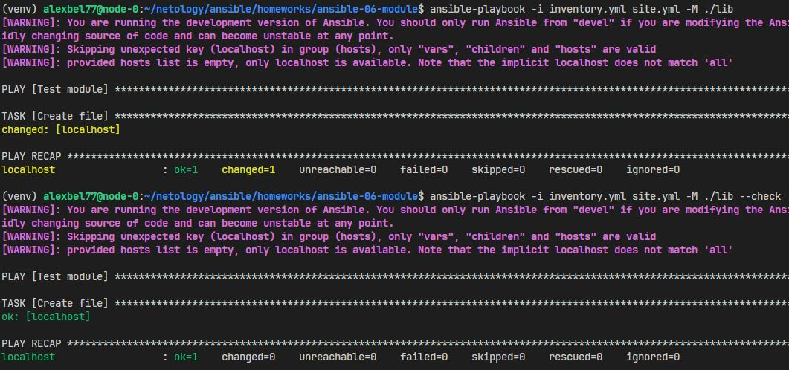

# Создание собственных модулей

1. В виртуальном окружении был создан модуль `managed_file`:

    - Функция `file_sha1` возвращает SHA1-хеш содержимого файла. Если файл не существует возвращает None.

    - Основная логика `run_module()`
        - Модуль принимает два параметра **path** и **content**

        - Сравнение хешей
            ```python
            before_hash = file_sha1(path)
            desired_hash = hashlib.sha1(content.encode('utf-8')).hexdigest()
            ```
        - Проверка на check-mode. Если запущен в режиме --check, модуль не делает изменений:
            ```python
            if module.check_mode:
                result['changed'] = needs_change
                module.exit_json(**result)
            ```

        - Изменение файла. Если необходимо создается папка и файл перезаписывается:

            ```python
            if needs_change:
                ...
                with open(path, "w", encoding="utf-8") as f:
                    f.write(content)
            ```
    Реализацию модуля можно посмотреть [тут](https://github.com/alex-bel31/ansible-collection-file-utils/blob/main/plugins/modules/managed_file.py)

2. Модуль был проверен на исполняемость локально с помощью:

    ```bash
    python -m ansible.modules.my_own_module payload.json
    ```

    <center>
    
    </center>

4. С помощью playbook модуль был проверен на идемпотентность с флагом `--check`:

    <center>
    
    </center>

5. Была инициализирована новая коллекция, заполнена документация и создана роль для модуля. Из локального архива установлена коллекция и проверена с помощью **playbook**:

    <center>
    
    </center>
    <center>
    
    </center>

**Ссылка на архив с collection** - [alex_bel31-file_utils-1.0.0.tar.gz](https://github.com/alex-bel31/ansible-collection-file-utils/blob/main/artifacts/alex_bel31-file_utils-1.0.0.tar.gz)

**Ссылка на репозиторий с collection** - [ansible-collection-file-utils](https://github.com/alex-bel31/ansible-collection-file-utils/tree/main)